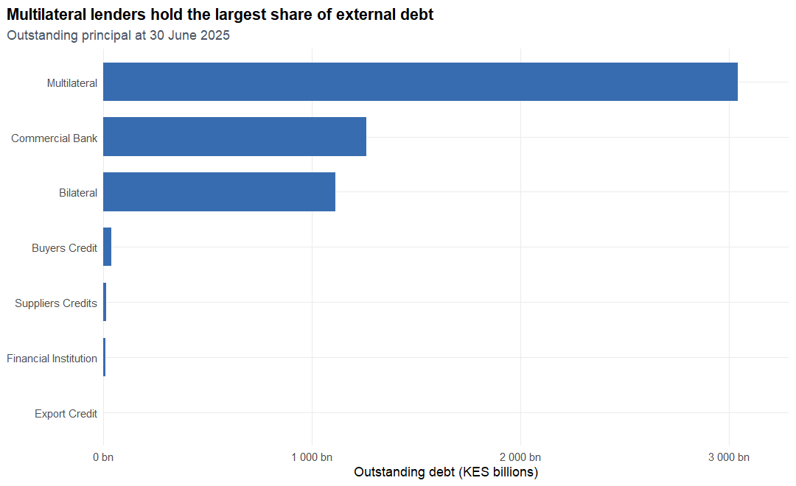
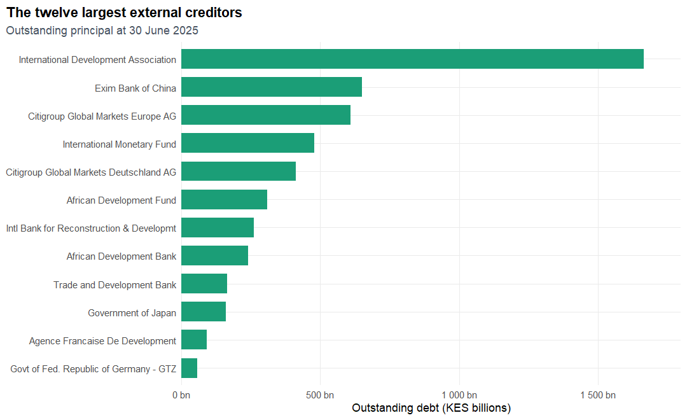
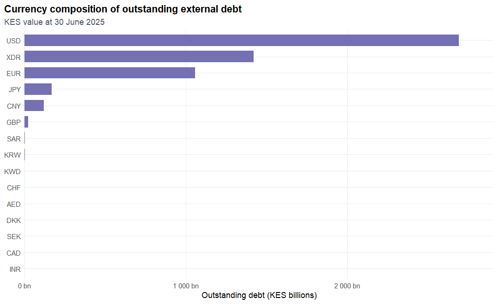
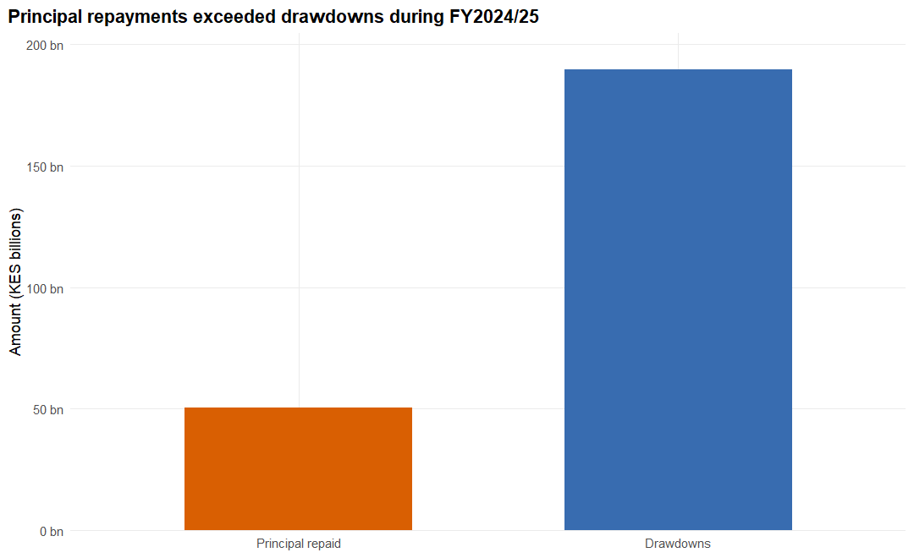
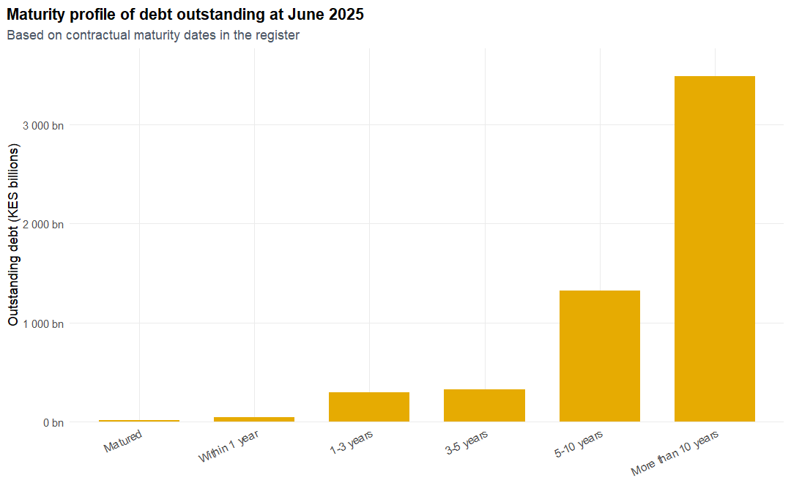
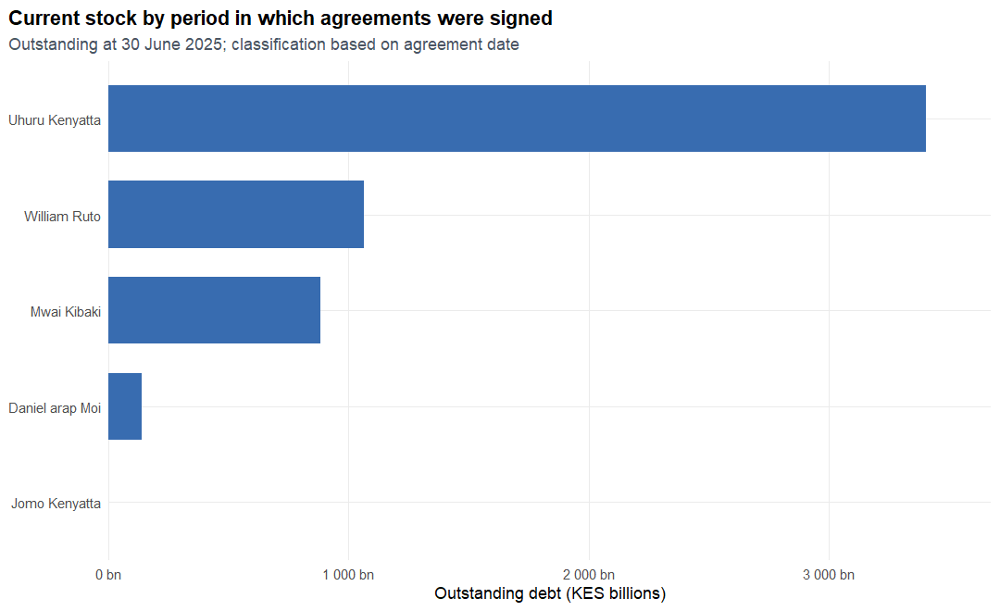

Kenya External Public Debt Register
================

This project presents Kenya’s loan-level external public debt recorded
by the National Treasury at **30 June 2025**. All debt-stock and
fiscal-year movement charts are reported in **Kenya shillings (KES)**
using the Treasury’s published KSh values; the analysis does not apply a
separate exchange-rate conversion.

Source: [National Treasury External Public Debt
Register](https://www.treasury.go.ke/external-public-debt-register).

## Headline position

| Indicator                         |        Value |
|:----------------------------------|-------------:|
| External debt outstanding         | KES 5.488 tn |
| Active loan records               |        1,008 |
| Distinct active loan IDs          |        1,008 |
| Principal repaid during FY2024/25 |  KES 50.4 bn |
| Drawdowns during FY2024/25        | KES 189.6 bn |

The loan-level closing balances total **KES 5.488 tn**. They differ from
the printed Treasury total by only KSh 11, within the documented KSh 100
rounding tolerance used by this project.

## Outstanding debt by creditor category

<!-- -->

| Creditor category     | Outstanding (KES bn) | Share of total |
|:----------------------|---------------------:|---------------:|
| Multilateral          |               3045.4 |          55.5% |
| Commercial Bank       |               1261.5 |          23.0% |
| Bilateral             |               1114.7 |          20.3% |
| Buyers Credit         |                 39.5 |           0.7% |
| Suppliers Credits     |                 14.4 |           0.3% |
| Financial Institution |                 11.0 |           0.2% |
| Export Credit         |                  1.9 |           0.0% |

## Largest creditors

<!-- -->

## Currency exposure measured in KES

The currency identifies the denomination of each loan. The bars show the
KES value of the outstanding stock, not a sum of incompatible
foreign-currency amounts.

<!-- -->

## Repayments and drawdowns during FY2024/25

<!-- -->

These are fiscal-year movements reported by Treasury. They should not be
read as the complete change in the KES debt stock because valuation and
prior-period adjustments can also change the closing balance.

## Maturity profile

<!-- -->

## Outstanding stock associated with presidential periods

This classification uses the agreement date and non-overlapping
presidential terms. It shows **June 2025 outstanding stock associated
with agreements signed in each period**. It does not claim that a
president personally borrowed the amount, nor does it measure total
disbursements received during a presidency.

<!-- -->

## Methodology and validation

The pipeline extracts only pages **3-29**, whose repeated heading is
`EXTERNAL PUBLIC DEBT REGISTER AS AT END JUNE 2025 (KSHS)`. Pages 1-2
contain summaries and pages 30-61 contain the separate FX register.

PDF words are assigned to columns using their page coordinates. This
avoids mixing wrapped loan titles, creditor names and two-line
categories. The output retains the source page and row for every record.

The validation checks found:

- 1,041 records and 1,041 distinct loan IDs;
- no duplicate loan/currency keys;
- no missing required fields or invalid dates/currencies;
- no unexpected creditor or borrower categories; and
- a KSh 11 difference from the printed closing total.

See [DATA_PIPELINE.md](DATA_PIPELINE.md) for extraction instructions and
detailed validation evidence.

## Limitations

- The register reports principal-related stock and movements; it is not
  a full fiscal-cost dataset and does not provide loan-level interest
  payments here.
- A row is treated as a loan record and IDs are counted distinctly. Some
  economic facilities may still contain multiple tranches or currency
  components.
- Agreement-date classifications do not capture when a loan was
  negotiated, approved, disbursed or ultimately spent.
- KES values can change because of exchange-rate valuation as well as
  borrowing and repayment flows.
