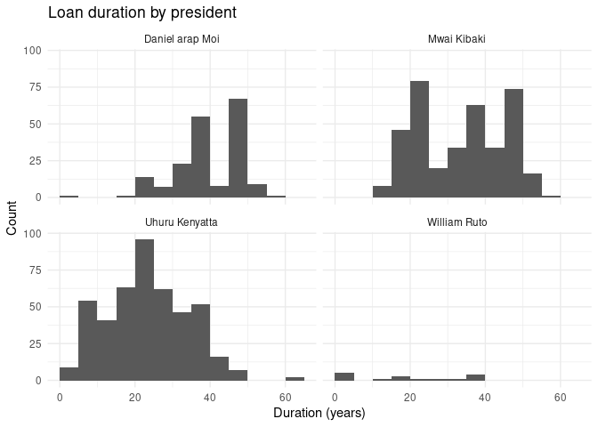
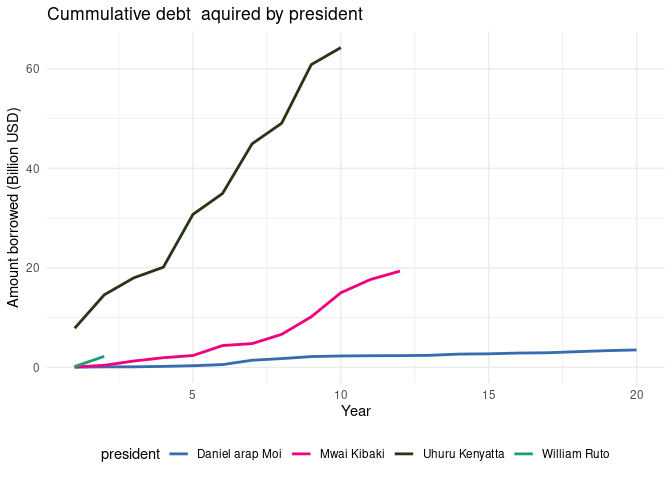

Kenya External Debt Register
================

## Steps Taken to Develop Public Debt Register data set

- Navigated to the Kenya National Treasury website and downloaded the
  public debt register data set.
- Extracted the data set using python and saved it as a csv file Script:
  Python/extract_data.py
- Extracted historical exchange rates data set from the
  <https://www.poundsterlinglive.com/bank-of-england-spot/historical-spot-exchange-rates/usd>
  and saved it as a csv file. Script: Python/historical_currency_data.py
- Downloaded USD inflation data set from
  <https://www.in2013dollars.com/us/inflation/1980?amount=1> to convert
  into todays equivalent dollars.
- Downloaded IMF SDR data from
  <https://www.imf.org/external/np/fin/data/rms_sdrv.aspx>. This will be
  used to convert XDR currency to USD
- Used the historical data to convert amounts to dollars and saved the
  data set as a csv file. Script: R/cleaning.R

## Currency Composition of Kenya’s External Debt

    ## Warning: package 'ggplot2' was built under R version 4.3.3

    ## Warning: package 'tidyr' was built under R version 4.3.3

    ## Warning: package 'readr' was built under R version 4.3.3

    ## Warning: package 'purrr' was built under R version 4.3.3

    ## Warning: package 'dplyr' was built under R version 4.3.3

    ## Warning: package 'stringr' was built under R version 4.3.3

    ## Warning: package 'lubridate' was built under R version 4.3.3

<!-- -->

## Loan Duration by President

<!-- -->

## Number of loans by creditor category

<!-- -->

## Histogram of loan duration by creditor category

<!-- -->

## Amount Borrowed by President in USD

<!-- -->

## Cummulative debt by president

- Please note other cumulative debt might includes interests
- This graph just looks how much a president borrowed when they were in
  power. This is external debt
- The CBK cumulative debt is the total debt that the country has
  borrowed - payments
- ***Have you guys checked how many loans EU gave to Kenya on
  2002-12-31. First day of Kibaki presidency***

<!-- -->

## Loans Still to Convert to USD

| loan_ref_number | creditor_name | agreement_date | org_financed_amount | revised_financed_amount | curr |
|:----------------|:--------------|:---------------|--------------------:|------------------------:|:-----|
