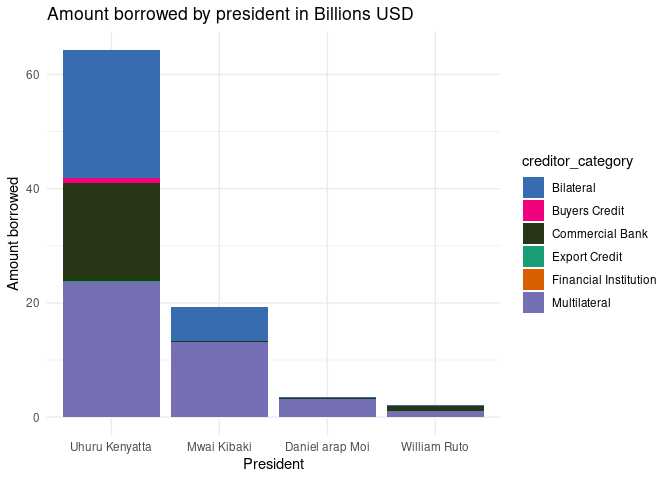
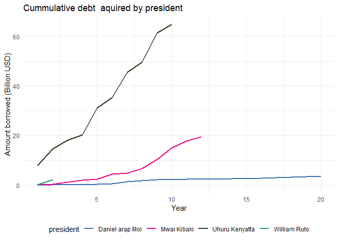

Kenya External Debt Register
================

## Steps Taken to Develop Public Debt Register data set

- Navigated to the Kenya National Treasury website and downloaded the
  public debt register data set.
- Extracted the data set using python and saved it as a csv file Script:
  Python/extract_data.py
- Extracted historical exchange rates data set from the
  <https://www.poundsterlinglive.com/bank-of-england-spot/historical-spot-exchange-rates/usd>
  and saved it as a csv file. Script: Python/historical_currency_data.py
- Downloaded USD inflation data set from
  <https://www.in2013dollars.com/us/inflation/1980?amount=1> to convert
  into todays equivalent dollars.
- Downloaded IMF SDR data from
  <https://www.imf.org/external/np/fin/data/rms_sdrv.aspx>. This will be
  used to convert XDR currency to USD
- Used the historical data to convert amounts to dollars and saved the
  data set as a csv file. Script: R/cleaning.R

## Currency Composition of Kenya’s External Debt

    ## Warning: package 'ggplot2' was built under R version 4.3.3

    ## Warning: package 'tidyr' was built under R version 4.3.3

    ## Warning: package 'readr' was built under R version 4.3.3

    ## Warning: package 'purrr' was built under R version 4.3.3

    ## Warning: package 'dplyr' was built under R version 4.3.3

    ## Warning: package 'stringr' was built under R version 4.3.3

    ## Warning: package 'lubridate' was built under R version 4.3.3

<!-- -->

## Loan Duration by President

<!-- -->

## Number of loans by creditor category

<!-- -->

## Histogram of loan duration by creditor category

<!-- -->

## Amount Borrowed by President in USD

<!-- -->

Amount Borrowed by President in 2024 USD

<!-- -->

## Cummulative debt by president

- Please note other cumulative debt might includes interests
- This graph just looks how much a president borrowed when they were in
  power. This is external debt
- The CBK cumulative debt is the total debt that the country has
  borrowed - payments
- ***Have you guys checked how many loans EU gave to Kenya on
  2002-12-31. First day of Kibaki presidency***

<!-- -->

## Loans Still to Convert to USD

| loan_ref_number | creditor_name                         | agreement_date | org_financed_amount | revised_financed_amount | curr |
|:----------------|:--------------------------------------|:---------------|--------------------:|------------------------:|:-----|
| 1983029_1       | African Development Fund              | 1983-05-11     |              296513 |                  296513 | INR  |
| 2000005_1       | Agence Francaise De Development       | 2000-07-04     |            15000000 |                13158482 | EUR  |
| 2001007_1       | Government of China                   | 2001-07-16     |            50000000 |                50000000 | CNY  |
| 2002005_1       | Government of China                   | 2002-04-24     |            50000000 |                50278653 | CNY  |
| 2007013_1       | KUWAIT FUND FOR ARAB ECONOMIC         | 2007-12-13     |             6000000 |                 6000000 | KWD  |
| 2010014_1       | International Development Association | 2010-07-05     |            15500000 |                15124563 | XDR  |
| 2010015_1       | International Development Association | 2010-07-05     |           217400000 |               217400000 | XDR  |
| 2010016_1       | International Development Association | 2010-07-05     |            66200000 |               123241901 | XDR  |
| 2010016_2       | International Development Association | 2010-07-05     |            66200000 |               123241901 | XDR  |
| 2010016_3       | International Development Association | 2010-07-05     |            66200000 |               123241901 | XDR  |
| 2010013_1       | KUWAIT FUND FOR ARAB ECONOMIC         | 2010-09-20     |             5900000 |                 4614430 | KWD  |
| 2010026_1       | Cooperation                           | 2010-11-25     |            36730000 |                31060530 | AED  |
| 2011021_1       | International Development Association | 2011-02-27     |            35000000 |                34977024 | XDR  |
| 2012012_1       | KUWAIT FUND FOR ARAB ECONOMIC         | 2012-01-01     |             4500000 |                 4500000 | KWD  |
| 2013032_1       | Cooperation                           | 2013-09-23     |            36730000 |                36730000 | AED  |
| 2015025_1       | International Development Association | 2015-01-01     |           131800000 |                74200000 | XDR  |
| 2015012_1       | Exim Bank of China                    | 2015-08-31     |           867293233 |               866358433 | CNY  |
| 2015035_1       | International Development Association | 2015-09-07     |            41300000 |                 2159695 | XDR  |
| 2016042_1       | International Development Association | 2016-07-04     |           105900000 |               105900000 | XDR  |
| 2016043_1       | International Development Association | 2016-07-04     |           106500000 |               106500000 | XDR  |
| 2016047_1       | International Development Association | 2016-07-04     |            12800000 |                12800000 | XDR  |
| 2017021_1       | International Development Association | 2017-05-29     |            73900000 |                73900000 | XDR  |
| 2018005_1       | KUWAIT FUND FOR ARAB ECONOMIC         | 2018-05-15     |             7000000 |                 7000000 | KWD  |
